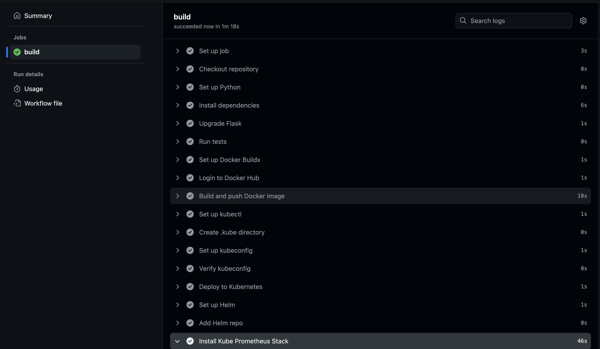
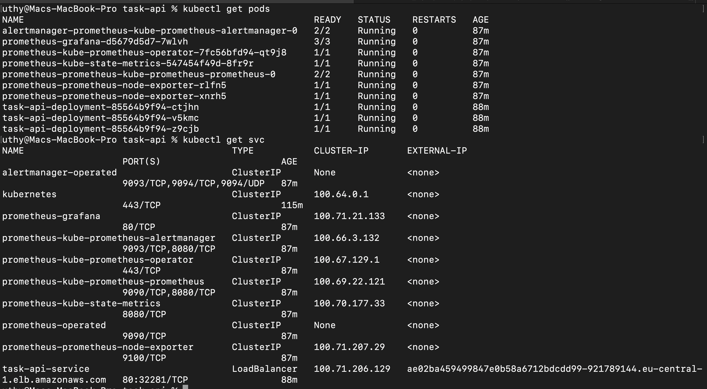
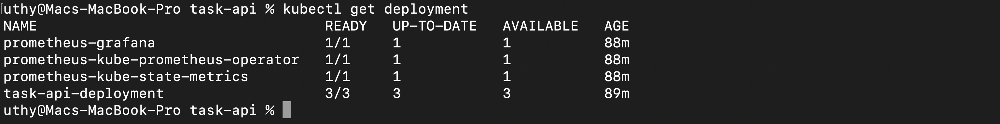
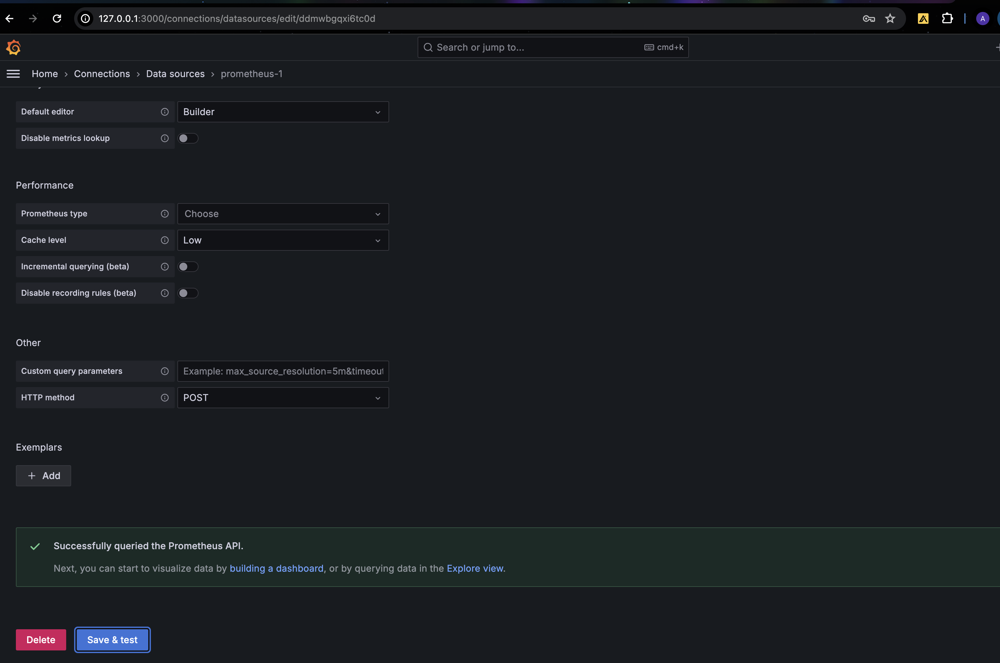
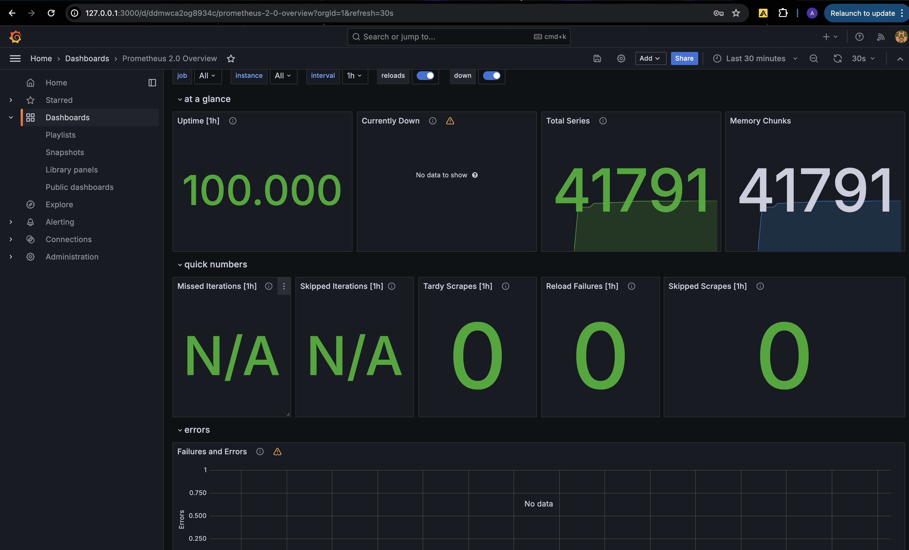
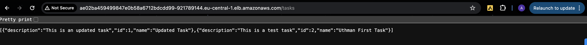
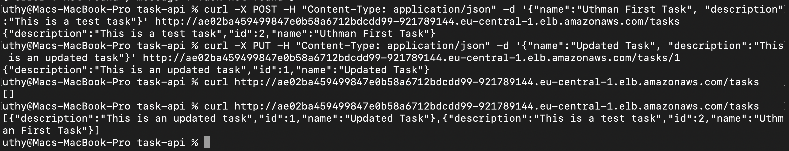

# Task Management API

## Introduction

This project is a simple REST API server for managing a task list. It provides endpoints to create, update, delete, and
view tasks. The application is containerized, deployed on a Kubernetes cluster, exposed using a loadbalancer and includes
monitoring with the Kube Prometheus Stack.

The CI/CD pipeline is automated using GitHub Actions.
    
    
## Setup and Installation
       
### Prerequisites

- Docker
- Kubernetes cluster (e.g., minikube, EKS, GKE, AKS)
- kubectl 
- Helm
- GitHub account

### Installation Steps

1. **Clone the repository:**
    
    ```bash
    git clone https://github.com/DevOpsGodd/Build-and-deploy-REST-Api-server.git
    cd task-api 
    ```

2. **Build the Docker image:**

    ```bash
    docker build -t yourusername/task-api:latest .
    ```

3. **Push the Docker image to a registry:**

    ```bash 
    docker push yourusername/task-api:latest
    ```

## API Endpoints
    
| Method | Endpoint        | Description          |
|--------|-----------------|----------------------|
| POST   | /tasks          | Create a new task    |
| PUT    | /tasks/{id}     | Update an existing task |
| DELETE | /tasks/{id}     | Delete a task        |
| GET    | /tasks          | View all tasks       |
    
## Containerization

The application is containerized using Docker. The Dockerfile is located in the `root` directory of the project.

```Dockerfile
# Dockerfile
FROM python:3.8-slim
WORKDIR /app
COPY . .
RUN pip install -r requirements.txt
CMD ["python", "src/main.py"]
```

## Kubernetes Deployment

The Kubernetes deployment files are located in the k8s directory.

`deployment.yaml:` Defines the Deployment for the task API.
`service.yaml:` Defines the Service to expose the Deployment using a LoadBalancer.


## Deploying to Kubernetes

Apply the deployment and service files:

```
kubectl apply -f k8s/deployment.yaml
kubectl apply -f k8s/service.yaml
```

## CI/CD Pipeline

The CI/CD pipeline is automated using GitHub Actions. The workflow file is located in '.github/workflows/deploy.yml.'

**Key Steps in the Pipeline:**

- Build the Docker image
- Push the image to Docker Hub
- Deploy the application to Kubernetes
- Deploy the Kube Prometheus Stack for monitoring





Here are the pods and services running in my cluster



And here is our deployment with 3 replicas




## Monitoring with Kube Prometheus Stack

The Kube Prometheus Stack is deployed on the same Kubernetes cluster for monitoring.

**Steps to Deploy:**

- Add the Helm repository for Prometheus:

```
helm repo add prometheus-community https://prometheus-community.github.io/helm-charts
helm repo update
```

- Install the Kube Prometheus Stack:

```
helm install prometheus prometheus-community/kube-prometheus-stack
```

- Access Grafana:

Obtain the Grafana admin password:

```
kubectl get secret --namespace default prometheus-grafana -o jsonpath="{.data.admin-password}" | base64 --decode ; echo
```

- Forward the Grafana port to your local machine:
```
kubectl port-forward service/prometheus-grafana 3000:80
```


- Access Grafana at `http://localhost:3000` and log in with the username admin and the password obtained in the previous 
step.


This is our prometheus successfully queried



This is my Grafana Dashboard



## Usage

After deployment, the Task API can be accessed through the LoadBalancer service. You can use tools like curl or Postman to 
interact with the API.



Example:

# Create a new task

curl -X POST http://<load-balancer-ip>/tasks -d '{"title": "New Task", "description": "Task description"}' -H 
"Content-Type: application/json"



## Conclusion

This project demonstrates a full cycle of application development and deployment, including containerization, Kubernetes 
deployment, CI/CD automation, and monitoring. 

This README serves as documentation to guide through each step and ensure the process is reproducible.

